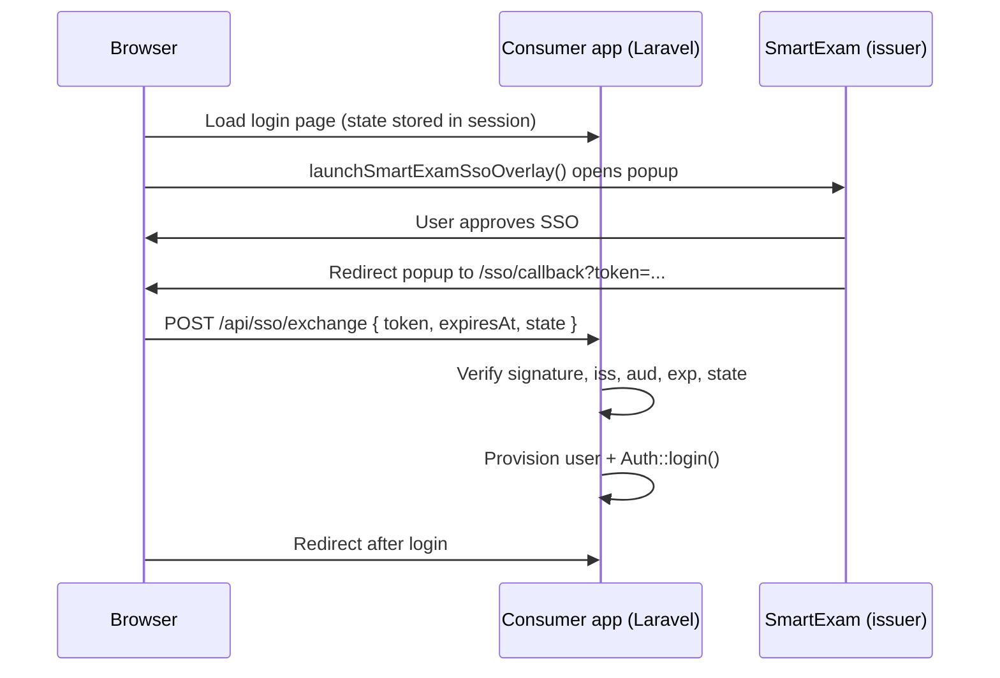

# ums-lspl/sso-client

Laravel package for **consumer applications** that authenticate users via SmartExam SSO.

SmartExam (UMS) issues a signed token after the user approves SSO. This package verifies that token, provisions or updates a local user, and creates a Laravel session.

> **Browser flow:** Load `/js/sso-overlay.js` from your SmartExam server to open the SSO prompt in a popup. This package handles **server-side** token verification and session creation via `/api/sso/exchange` or the GET callback route.

## Requirements

- PHP 8.2+
- Laravel 10, 11, or 12
- A registered SSO application in **SmartExam Admin → SSO → Applications**

## How it works



Two login paths are supported:

| Flow | When to use | Endpoint |
|------|-------------|----------|
| **Popup + exchange** (recommended) | Login page with overlay script | `POST /api/sso/exchange` |
| **Full redirect** | Simple redirect-only integration | `GET /sso/callback` |

## Installation

```bash
composer require ums-lspl/sso-client
php artisan vendor:publish --tag=smartexam-sso-config
php artisan vendor:publish --tag=smartexam-sso-migrations
php artisan migrate
```

The migration adds a nullable, unique `smartexam_id` column to the `users` table.

## Configuration

Add these to your consumer app `.env`:

```env
SMARTEXAM_URL=https://your-ums-server.example.com
SSO_CLIENT_KEY=your-client-key
SSO_CLIENT_SECRET=your-client-secret
SSO_CALLBACK_URL=https://your-app.example.com/sso/callback
SSO_AFTER_LOGIN_REDIRECT=/
```

| Variable | Required | Description |
|----------|----------|-------------|
| `SMARTEXAM_URL` | Yes | Base URL of the SmartExam / UMS server. Must match the `iss` claim in tokens. |
| `SSO_CLIENT_KEY` | Yes | Client key from SmartExam Admin → SSO → Applications. |
| `SSO_CLIENT_SECRET` | Yes | Client secret used to verify token HMAC signatures. |
| `SSO_CALLBACK_URL` | Yes | Registered callback URL. Must match what you pass as `redirectUrl` in the overlay script. |
| `SSO_AFTER_LOGIN_REDIRECT` | No | Path or URL to redirect to after successful login. Default: `/`. |
| `SSO_AUDIENCE` | No | Must match the `aud` claim in tokens. Defaults to the origin of `SSO_CALLBACK_URL`, then `APP_URL`. |
| `SMARTEXAM_SSO_ROUTES` | No | Enable/disable auto-registered routes. Default: `true`. |
| `SMARTEXAM_SSO_ROUTE_PREFIX` | No | Optional prefix for SSO routes. Default: empty. |

Register `SSO_CALLBACK_URL` in **SmartExam Admin → SSO → Applications** for your client key.

### Audience (`aud`) claim

SmartExam tokens include an `aud` (audience) claim set to your consumer app's base URL. The verifier compares this against `config('smartexam-sso.audience')`.

By default, audience is derived from the origin of `SSO_CALLBACK_URL`. If your callback URL is `https://your-app.example.com/sso/callback`, audience becomes `https://your-app.example.com`.

Set `SSO_AUDIENCE` explicitly when the token audience differs from the callback URL origin.

## User model

Add `smartexam_id` to your User model's `$fillable` array:

```php
protected $fillable = [
    // ...
    'smartexam_id',
];
```

## User provisioning

By default the package uses `DefaultSsoUserProvisioner`, which `updateOrCreate`s users by email and sets `smartexam_id` from the token `sub` claim.

To customize, implement `SmartExam\SsoClient\Contracts\SsoUserProvisioner` and register it in `config/smartexam-sso.php`:

```php
'user_provisioner' => App\Services\YourSsoUserProvisioner::class,
```

## Browser integration (popup flow)

Ensure your layout `<head>` includes a CSRF meta tag (required for the exchange POST):

```html
<meta name="csrf-token" content="{{ csrf_token() }}">
```

Minimal integration:

```html
<script src="https://your-ums-server.example.com/js/sso-overlay.js" defer></script>
<script>
async function signInWithSmartExam() {
    const { token, expiresAt, state } = await window.launchSmartExamSsoOverlay({
        baseUrl: 'https://your-ums-server.example.com',
        clientKey: 'YOUR_CLIENT_KEY',
        redirectUrl: 'https://your-app.example.com/sso/callback',
        state: '...', // from SsoState::remember() in session
    });

    await fetch('/api/sso/exchange', {
        method: 'POST',
        headers: {
            'Content-Type': 'application/json',
            'Accept': 'application/json',
            'X-CSRF-TOKEN': document.querySelector('meta[name="csrf-token"]').content,
        },
        credentials: 'same-origin',
        body: JSON.stringify({ token, expiresAt, state }),
    });

    window.location.href = '/';
}
</script>
```

### CSRF state

Before opening SSO, store state in session:

```php
use SmartExam\SsoClient\Support\SsoState;

$state = SsoState::remember();
// pass $state to launchSmartExamSsoOverlay({ ..., state })
```

Both controllers verify it with `hash_equals` and clear it after a successful login. If no state is stored in session, verification is skipped (not recommended for production).

## Routes (auto-registered)

| Method | Route | Name | Controller |
|--------|-------|------|------------|
| GET | `/sso/callback` | `smartexam-sso.callback` | `SsoCallbackController` |
| POST | `/api/sso/exchange` | `smartexam-sso.exchange` | `SsoExchangeController` |

Both routes use the `web` middleware group (session + CSRF for exchange).

Customize paths in `config/smartexam-sso.php`:

```php
'routes' => [
    'enabled' => env('SMARTEXAM_SSO_ROUTES', true),
    'prefix' => env('SMARTEXAM_SSO_ROUTE_PREFIX', ''),
    'middleware' => ['web'],
    'callback' => 'sso/callback',
    'exchange' => 'api/sso/exchange',
],
```

### GET callback (redirect flow)

SmartExam redirects the browser to:

```
GET /sso/callback?token=...&expires_at=...&state=...
```

The callback controller verifies the token, logs the user in, and redirects to `SSO_AFTER_LOGIN_REDIRECT`.

### POST exchange (popup flow)

After the popup lands on the callback URL, the overlay script reads the token and your page POSTs:

```
POST /api/sso/exchange
Content-Type: application/json

{ "token": "...", "expiresAt": 1717939200, "state": "..." }
```

Success response (`200`):

```json
{
    "message": "Authenticated",
    "user": {
        "id": 1,
        "name": "Jane Doe",
        "email": "jane@example.com"
    }
}
```

Error response (`401`):

```json
{ "message": "Invalid SSO token signature." }
```

## Token format

Tokens are `{base64_payload}.{hmac_sha256_signature}` signed with `SSO_CLIENT_SECRET`.

Verified payload fields:

| Claim | Description |
|-------|-------------|
| `iss` | Issuer — must equal `SMARTEXAM_URL` |
| `aud` | Audience — must equal `config('smartexam-sso.audience')` |
| `sub` | SmartExam user ID (stored as `smartexam_id`) |
| `name` | Display name |
| `email` | Email address |
| `iat` | Issued-at timestamp |
| `exp` | Expiry timestamp |
| `session_id` | SmartExam session identifier |

## Example: client end

The following shows a complete integration as used in the **client end** consumer app.

### `.env`

```env
SMARTEXAM_URL=https://umsdemo.ucanapply.com
SSO_CLIENT_KEY=your-client-key
SSO_CLIENT_SECRET=your-client-secret
SSO_CALLBACK_URL=https://mail-server.ucanapply.com/sso/callback
SSO_AFTER_LOGIN_REDIRECT=/dashboard
```

### `config/smartexam-sso.php`

```php
'user_provisioner' => App\Services\SmartExamSsoUserProvisioner::class,
```

### User model (`app/Models/User.php`)

```php
protected $fillable = [
    'name',
    'email',
    'password',
    'mobile',
    'status',
    'username',
    'smartexam_id',
];
```

### Custom provisioner (`app/Services/SmartExamSsoUserProvisioner.php`)

```php
namespace App\Services;

use App\Models\User;
use Illuminate\Contracts\Auth\Authenticatable;
use Illuminate\Support\Str;
use SmartExam\SsoClient\Contracts\SsoUserProvisioner;

class SmartExamSsoUserProvisioner implements SsoUserProvisioner
{
    public function fromPayload(array $payload): Authenticatable
    {
        $user = User::query()
            ->where('smartexam_id', $payload['sub'])
            ->first();

        if ($user === null) {
            $user = User::query()
                ->where('email', $payload['email'])
                ->first();
        }

        if ($user !== null) {
            $user->update([
                'name' => $payload['name'],
                'email' => $payload['email'],
                'smartexam_id' => $payload['sub'],
            ]);

            return $user->fresh();
        }

        return User::create([
            'name' => $payload['name'],
            'email' => $payload['email'],
            'smartexam_id' => $payload['sub'],
            'username' => $this->uniqueUsername($payload['email']),
            'password' => \Crypt::encrypt(Str::random(32)),
            'status' => 1,
        ]);
    }

    private function uniqueUsername(string $email): string
    {
        $base = Str::slug(Str::before($email, '@'), '_');
        $base = $base !== '' ? $base : 'sso_user';
        $username = Str::limit($base, 100, '');

        $suffix = 1;
        while (User::query()->where('username', $username)->exists()) {
            $suffix++;
            $username = Str::limit($base, 100 - strlen((string) $suffix), '').$suffix;
        }

        return $username;
    }
}
```

Provisioning logic in this example:

1. Look up by `smartexam_id` (`sub` claim) first.
2. Fall back to email if no match.
3. Update name, email, and `smartexam_id` on existing users.
4. Create new users with a generated username and random encrypted password.

### Auth layout (`resources/views/components/layouts/auth/simple.blade.php`)

```blade
@php
    $ssoState = session(config('smartexam-sso.state_session_key'));
    if (blank($ssoState)) {
        $ssoState = \SmartExam\SsoClient\Support\SsoState::remember();
    }
    $ssoRedirectUrl = config('smartexam-sso.callback_url') ?: url(route('smartexam-sso.callback'));
@endphp
<script src="{{ rtrim(config('smartexam-sso.issuer'), '/') }}/js/sso-overlay.js" defer></script>
<script>
async function signInWithSmartExam() {
    const csrfToken = document.querySelector('meta[name="csrf-token"]')?.content;

    if (!csrfToken) {
        alert('CSRF token missing. Please refresh the page and try again.');
        return;
    }

    try {
        const { token, expiresAt, state } = await window.launchSmartExamSsoOverlay({
            baseUrl: @json(config('smartexam-sso.issuer')),
            clientKey: @json(config('smartexam-sso.client_key')),
            redirectUrl: @json($ssoRedirectUrl),
            state: @json($ssoState),
        });

        const response = await fetch(@json(url(route('smartexam-sso.exchange', [], false))), {
            method: 'POST',
            headers: {
                'Content-Type': 'application/json',
                'Accept': 'application/json',
                'X-CSRF-TOKEN': csrfToken,
            },
            credentials: 'same-origin',
            body: JSON.stringify({ token, expiresAt, state }),
        });

        const data = await response.json().catch(() => ({}));

        if (!response.ok) {
            alert(data.message ?? 'SSO login failed. Please try again.');
            return;
        }

        window.location.href = @json(url(config('smartexam-sso.after_login_redirect', '/dashboard')));
    } catch (error) {
        if (error?.message !== 'Popup was closed by the user') {
            alert(error?.message ?? 'SSO login failed. Please try again.');
        }
    }
}
</script>
```

### Login button (`resources/views/livewire/auth/login.blade.php`)

```blade
<flux:button type="button" variant="outline" class="w-full" onclick="signInWithSmartExam()">
    Sign in with SmartExam
</flux:button>
```

## Troubleshooting

| Symptom | Likely cause |
|---------|--------------|
| `Unexpected token audience` | `SSO_AUDIENCE` / callback origin does not match the token `aud` claim. Check SmartExam SSO application settings. |
| `Unexpected token issuer` | `SMARTEXAM_URL` does not match token `iss`. |
| `Invalid SSO state parameter` | Session expired or state was not stored before opening the overlay. Reload the login page. |
| `CSRF token missing` | Add `<meta name="csrf-token">` to your layout head. |
| `SSO client secret is not configured` | Set `SSO_CLIENT_SECRET` in `.env` and run `php artisan config:clear`. |

## Testing

```bash
composer install
./vendor/bin/phpunit
```

## License

MIT
