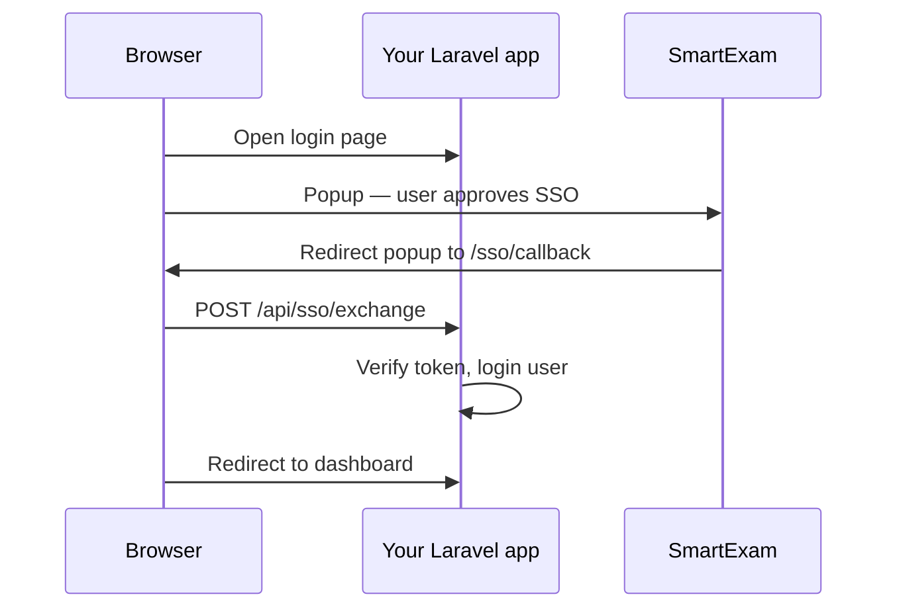

# ums-lspl/sso-client

Laravel package for consumer apps that sign users in with **SmartExam SSO**.

SmartExam issues a signed token after the user approves login. This package verifies the token, creates or updates a local user, and starts a Laravel session.

**Requirements:** PHP 8.1+, Laravel 9–13, and an SSO application in **SmartExam Admin → SSO → Applications**.

---

## Quick start

### 1. Install

```bash
composer require ums-lspl/sso-client
php artisan vendor:publish --tag=smartexam-sso-config
php artisan vendor:publish --tag=smartexam-sso-migrations
php artisan migrate
```

This adds a nullable, unique `smartexam_id` column to `users`.

### 2. Configure `.env`

```env
SMARTEXAM_URL=https://your-ums-server.example.com
SSO_CLIENT_KEY=your-client-key
SSO_CLIENT_SECRET=your-client-secret
SSO_CALLBACK_URL=https://your-app.example.com/sso/callback
SSO_AFTER_LOGIN_REDIRECT=/
```

Register the same `SSO_CALLBACK_URL` in SmartExam Admin for your client key.

### 3. Update your User model

```php
protected $fillable = [
    // ...
    'smartexam_id',
];
```

### 4. Add SSO to your login page

In your auth layout `<head>`:

```html
<meta name="csrf-token" content="{{ csrf_token() }}">
```

In the layout body (no publish step needed):

```blade
@include('smartexam-sso::login-script')
```

On your login button:

```blade
<button type="button" onclick="signInWithSmartExam()">Sign in with SmartExam</button>
```

That’s it. The partial loads the SmartExam overlay, stores CSRF state, opens the popup, and POSTs to the exchange route.

---

## How it works



**Recommended:** popup + exchange (`POST /api/sso/exchange`) — handled by `@include('smartexam-sso::login-script')`.

**Alternative:** full browser redirect to `GET /sso/callback` (no popup, no JavaScript).

---

## Publish tags

| Tag | Use when |
|-----|----------|
| `smartexam-sso-config` | You need to customize routes, provisioner, etc. |
| `smartexam-sso-migrations` | First install — adds `smartexam_id` |
| `smartexam-sso-views` | You want to edit the login script |

Views are optional. To customize the login script:

```bash
php artisan vendor:publish --tag=smartexam-sso-views
```

```blade
@include('vendor.smartexam-sso.login-script')
```

---

## Environment variables

| Variable | Required | Description |
|----------|----------|-------------|
| `SMARTEXAM_URL` | Yes | SmartExam server URL (must match token `iss`) |
| `SSO_CLIENT_KEY` | Yes | Client key from SmartExam Admin |
| `SSO_CLIENT_SECRET` | Yes | Secret used to verify token signatures |
| `SSO_CALLBACK_URL` | Yes | Your callback URL (must match SmartExam registration) |
| `SSO_AFTER_LOGIN_REDIRECT` | No | Where to go after login. Default: `/` |
| `SSO_AUDIENCE` | No | Token `aud` claim. Default: origin of `SSO_CALLBACK_URL` |
| `SMARTEXAM_SSO_ROUTES` | No | Enable package routes. Default: `true` |
| `SMARTEXAM_SSO_ROUTE_PREFIX` | No | Prefix for SSO routes. Default: empty |
| `SMARTEXAM_SSO_REQUIRE_STATE` | No | Require session state. Default: `true` |

---

## Routes

Registered automatically (customize in `config/smartexam-sso.php`):

| Method | Path | Name |
|--------|------|------|
| GET | `/sso/callback` | `smartexam-sso.callback` |
| POST | `/api/sso/exchange` | `smartexam-sso.exchange` |

---

## Customization

### Custom user provisioning

Default behavior: find or create user by email, set `smartexam_id` from token `sub`.

For custom logic, implement `SmartExam\SsoClient\Contracts\SsoUserProvisioner`:

```php
// config/smartexam-sso.php
'user_provisioner' => App\Services\YourSsoUserProvisioner::class,
```

### Post-login hook

```php
use SmartExam\SsoClient\Events\SmartExamSsoAuthenticated;

Event::listen(SmartExamSsoAuthenticated::class, function ($event) {
    // $event->user, $event->payload
});
```

### URL helpers

```php
use SmartExam\SsoClient\Support\SsoUrl;

SsoUrl::overlayScript();  // SmartExam /js/sso-overlay.js URL
SsoUrl::connect($state);  // Full-page SSO connect URL
SsoUrl::issuerSignIn();   // SmartExam sign-in page
```

---

## Troubleshooting

| Error | Fix |
|-------|-----|
| Unexpected token audience | Set `SSO_AUDIENCE` to match your app URL |
| Unexpected token issuer | `SMARTEXAM_URL` must match token issuer |
| Invalid / missing SSO state | Use `@include('smartexam-sso::login-script')` or reload login page |
| CSRF token missing | Add `<meta name="csrf-token">` to layout |
| SSO client secret is not configured | Set `SSO_CLIENT_SECRET`, run `php artisan config:clear` |

---

## Testing

```bash
composer test
```

## License

MIT
